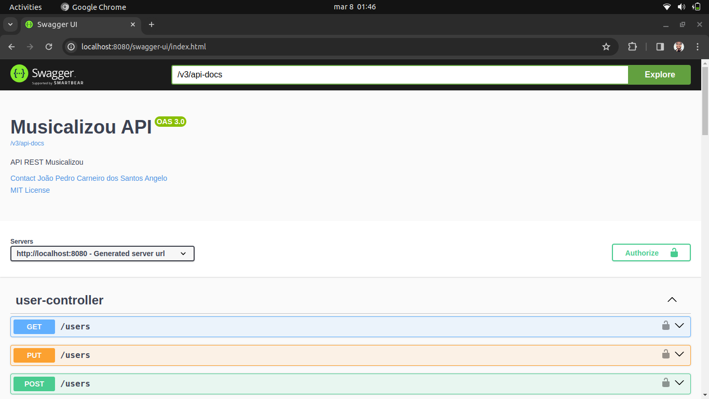
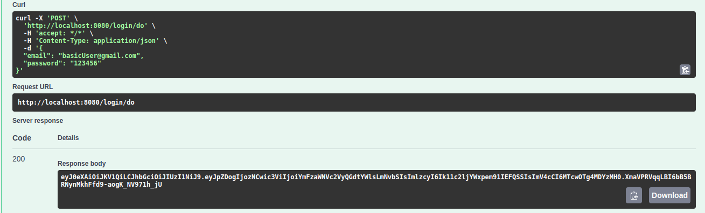
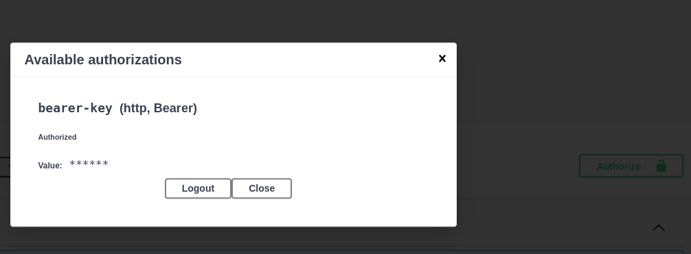

# Musicalizou

> Musicalizou é uma API REST que permite aos usuários e desenvolvedores acessar e 
> manipular dados de músicas, artistas e avaliações. 

---
## Funcionalidades Principais

- **Explorar Músicas**;
- **Reviews das músicas**;
- **Gerenciamento de Artistas**; 
- **Login e controle de acesso**;
- **Histórico da Base de Dados (migrations)**.

---
## Tecnologias Utilizadas

- **Spring Boot**; 
- **Spring Security**;
- **Spring Data JPA**;
- **Spring Tests**;
- **Validações**;
- **Lombok**;
- **MySQL**; 
- **Migrations com Flyway**;
- **Hashing de Senha com BCrypt**;
- **JWT (JSON Web Tokens)**;
- **Swagger para documentação**.

---
## Como Executar

1. **Configuração do Ambiente:**
    - Certifique-se de ter o Java JDK e o MySQL instalados em sua máquina.
    - Clone o repositório do Musicalizou para o seu ambiente local.

2. **Configuração do Banco de Dados:**
    - Configure as credenciais do banco de dados no arquivo `application.properties`.

3. **Execução da API:**
    - Abra o projeto em sua IDE preferida.
    - Execute o aplicativo Spring Boot.

4. **Acesso à API:**
    http://localhost:8080/swagger-ui/index.html
    

5. **Realizar Login:**
    

6. **Copiar Token para autorização:**
    

7. **Requisições liberadas:**
    Depois de inserir o token no campo de autorização,
    todas as requisições estarão liberadas.

---
## Melhorias para o futuro

- **Desenvolvimento do Front-end**: Embora a API REST do Musicalizou forneça acesso aos dados, uma interface de usuário (UI) pode ser desenvolvida e integrada para facilitar a interação com os recursos da API.

- **Preparação para o Deploy**: Realizar as modificações necessárias para o deploy da aplicação.

---
## Contribuição

Se você deseja contribuir com o desenvolvimento do Musicalizou, siga estas etapas:

1. Faça um fork do repositório e clone o fork para o seu ambiente local.
2. Crie uma branch para sua nova funcionalidade ou correção de bug: `git checkout -b nome-da-sua-branch`.
3. Faça suas alterações e adicione testes, se aplicável.
4. Commit suas alterações: `git commit -m 'Descrição das alterações'`.
5. Push para a branch: `git push origin nome-da-sua-branch`.
6. Abra um pull request no repositório original.

Sinta-se à vontade para contribuir com esta aplicação!

---
## Licença

O Musicalizou é licenciado sob a [MIT License](LICENSE).
